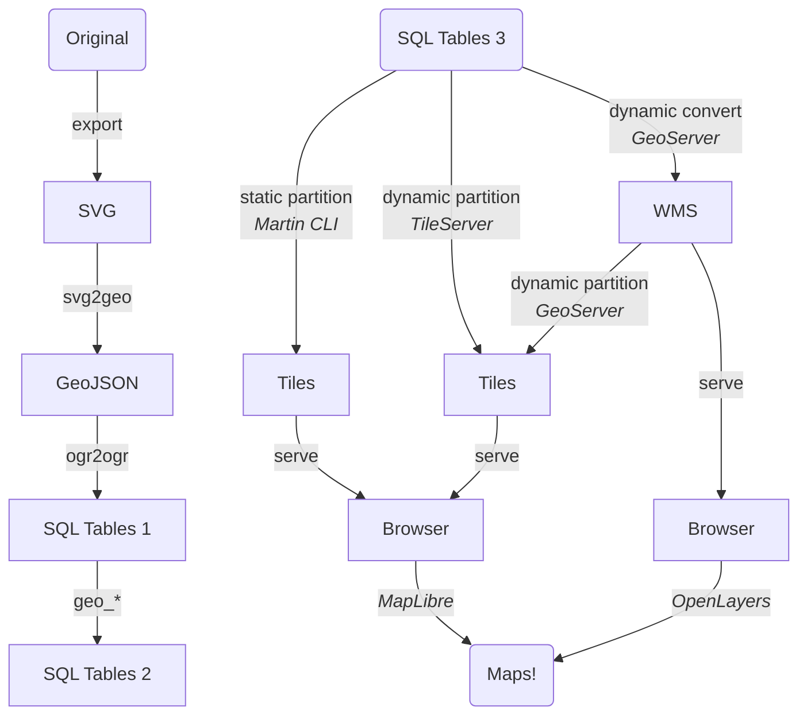

The left image is straightforward, there are little choices, apart from the schemas
involved.  They can quickly be revisited and easily altered.

The right, depicting the way the raw data reaches the end user, shows choices that
need to be made that will have wasted a lot of effort, if changed at a later time.
The simplest but most rigid solution is on the left, the most complex providing
many flexible extensions on the right.

A SW package is named only as example, not as the only SW option. (Finding SW
options and how to configure such a SW is a main piece of the "wasted effort if
changed".)

## SQL Tables 2 -> 3

Note that the structure of the DB data also depends on the way it is being served.
I therefore added a DB restructuring step not shown in the diagram.
